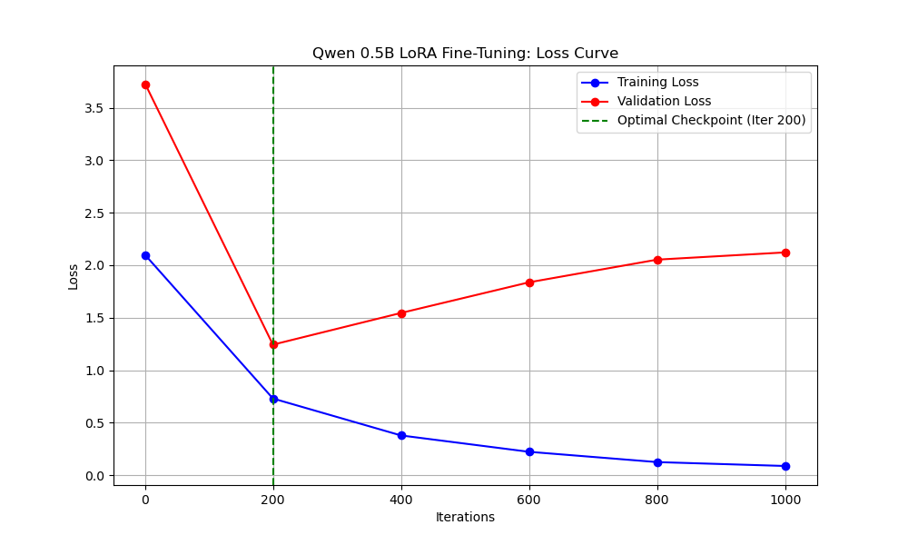

# Real-Time Financial Sentiment Engine
### Fine-Tuned Qwen-2.5 0.5B on Apple Silicon · Apache Kafka · PySpark · Elasticsearch

An end-to-end Big Data pipeline and Applied AI project that ingests real-time financial social media data, analyzes sentiment using a custom fine-tuned LLM running natively on Apple Silicon (MLX), and visualizes structured trading signals on a live dashboard.

---

## The Problem & Vision

Financial markets move fast, and they speak their own language. Standard, general-purpose LLMs often struggle with complex financial jargon and sarcasm — for example:

> *"The company is bleeding cash but margins are fat."*

Using massive, closed-source models (like GPT-4o) via API to process millions of live streaming posts is also incredibly slow and prohibitively expensive.

**The Solution: Teacher-Student Knowledge Distillation**

A large "Teacher" model (`gpt-4o-mini`) generates a high-quality, perfectly formatted dataset of financial reasoning. Apple's **MLX** framework is then used to fine-tune a small, blazingly fast "Student" model (**Qwen-2.5 0.5B Instruct**) on an M-series Mac.

The result is a **local, highly specialized financial AI** that integrates directly into an Apache Kafka and PySpark pipeline — outputting deterministic JSON trading signals at zero recurring API cost.

---

## Architecture Overview

The system is composed of five primary components:

```
Social Media Posts
        │
        ▼
┌─────────────────────┐
│   Kafka Producer    │  reddit_producer.py — simulates live financial posts
│   (Data Firehose)   │  → topic: financial_raw_text
└────────┬────────────┘
         │
         ▼
┌─────────────────────┐
│   PySpark Stream    │  spark_streaming.py — filters for tickers ($AAPL)
│   (Filter Layer)    │  → calls LLM inference via Spark UDF
└────────┬────────────┘
         │
         ▼
┌─────────────────────┐
│   FastAPI + MLX     │  server.py — hosts fine-tuned Qwen locally
│   (AI Inference)    │  → POST /analyze → structured JSON signals
└────────┬────────────┘
         │
         ▼
┌─────────────────────┐
│   Elasticsearch     │  stores enriched sentiment data
│   + Kibana          │  → live dashboard at localhost:5601
└─────────────────────┘
```

| Component | Description |
|---|---|
| **AI Distillation & Fine-Tuning** (`llm_finetuning/`) | Uses OpenAI's API for Teacher-Student data generation. Trains Low-Rank Adapters (LoRA) natively on Apple Unified Memory via `mlx_lm`. |
| **Data Ingestion** (`ingestion/`) | Kafka Producer that simulates live WallStreetBets-style financial posts, streaming raw JSON to `financial_raw_text`. |
| **Stream Processing** (`processing/`) | PySpark job consuming the Kafka stream, applying regex to extract tickers, and enriching data via a Spark UDF calling the local model. |
| **LLM Inference Server** (`inference/`) | FastAPI server hosting the fine-tuned Qwen model. Accepts raw text, returns strict JSON with ticker, sentiment score (-1.0 to 1.0), and reasoning. |
| **Storage & Visualization** (`infrastructure/`) | Docker Compose manages a Bitnami Kafka broker (KRaft), Elasticsearch (the Spark sink), and a Kibana dashboard. |

---

## Model Training & Fine-Tuning

To optimize for local edge-device inference with zero recurring API costs, this project uses the highly efficient **Qwen-2.5 0.5B Instruct** model. It is fine-tuned locally using Apple's MLX framework, leveraging the Unified Memory architecture of the Apple M-Series chips.

### 1. Teacher-Student Knowledge Distillation

Because a 500-million parameter base model lacks deep pre-trained knowledge of Wall Street slang and struggles to consistently output strict JSON, we use a **Teacher-Student Distillation** pipeline (`llm_finetuning/distill_data.py`). Here is exactly how it works in this project:

- **The Raw Data:** The script pulls raw financial tweets from the Hugging Face dataset `zeroshot/twitter-financial-news-sentiment`.
- **The Teacher (`gpt-4o-mini`):** The OpenAI API is prompted to act as an "expert Wall Street quantitative analyst." It reads the raw tweets and is forced via a temperature of `0.0` to output perfectly formatted JSON containing the extracted ticker, a sentiment score (-1.0 to 1.0), and a brief reasoning.
- **The Student (`Qwen-2.5 0.5B`):** The Teacher's high-quality JSON responses are programmatically wrapped into Qwen's native ChatML token structure (e.g., `<|im_start|>system...<|im_end|>`).
- **The Result:** This process generates a synthetic dataset of 500 training examples (`train.jsonl`) and 100 unseen validation examples (`valid.jsonl`). We are effectively transferring the reasoning capabilities and JSON-compliance of a massive, closed-source model into our tiny, local model.
- **Token Packing:** To maximize MLX training efficiency, `pack_dataset.py` groups multiple ChatML conversations into dense 2,048-token blocks, preventing wasted compute on padding tokens.

### 2. LoRA (Low-Rank Adaptation) Fine-Tuning

Updating all 500 million parameters of the base model would require massive VRAM and could cause "catastrophic forgetting" (where the model forgets its baseline English comprehension). Instead, we use **LoRA** via the `mlx_lm` library (`llm_finetuning/train_mlx.sh`). Here is how LoRA is applied in this pipeline:

- **Freezing the Base Model:** The original pre-trained weights of Qwen-2.5 0.5B are frozen.
- **Injecting Adapters:** The MLX script injects small, trainable rank-decomposition matrices (adapters) into **16 layers** of the model's transformer architecture.
- **Hardware Efficiency:** Because we are only calculating gradients for these tiny adapter layers rather than the full model, peak memory usage stays at just **4.85 GB**, allowing it to train natively on an Apple Silicon Mac.
- **Hyperparameters:** The model trains with a batch size of 8 for 1,000 iterations using a deliberately low learning rate of `1e-5` to preserve base intelligence.

| Hyperparameter | Value |
|---|---|
| **Batch Size** | 8 |
| **Iterations** | 1,000 |
| **LoRA Layers** | 16 |
| **Learning Rate** | 1e-5 |

**Training Hardware & Performance**

| Metric | Value |
|---|---|
| **Processing Speed** | ~900–1,000 tokens/second |
| **Peak Unified Memory Usage** | 4.85 GB |
| **Experiment Tracking** | Weights & Biases (W&B) — real-time loss curves |

### 3. Checkpoint Fusion & Overfitting Prevention

During the 1,000-iteration training run, training loss drops steadily to **0.087**. However, because our synthetic dataset is only 500 rows, Weights & Biases (W&B) validation monitoring reveals that **peak generalization on unseen data occurs at Iteration 200** (Validation Loss: **1.243**). After Iteration 200, the validation loss slowly rises — a clear indicator that the model is overfitting and memorizing the training data instead of learning transferable financial concepts.

**The Solution (`llm_finetuning/fuse_model.sh`):** Rather than using the overfitted Iteration 1,000 weights, the pipeline selects the adapters generated at the **Iteration 200 checkpoint**. The fusion script mathematically matrix-multiplies these specific LoRA adapters directly back into the base Qwen weights. This results in a single, standalone executable model (`./inference/fused-qwen-finance`) that is permanently specialized for financial JSON extraction and ready to be served by the FastAPI engine at sub-100ms latency.



---

## Prerequisites

- **Hardware:** Apple Silicon Mac (M1/M2/M3/M4) — required for MLX training
- **Docker:** Docker Desktop for the Kafka and Elastic stack
- **API Keys:** An OpenAI API key *(only needed for the dataset distillation phase)*
- **Python Dependencies:**

```bash
pip install mlx-lm fastapi uvicorn pyspark confluent-kafka elasticsearch openai python-dotenv
```

---

## Getting Started

### 1. Fine-Tune the Model *(skip if adapters are already fused)*

Create a `.env` file in the root directory:

```env
OPENAI_API_KEY=sk-...
```

Run the Teacher-Student distillation pipeline:

```bash
# Generate synthetic training data via gpt-4o-mini
python llm_finetuning/distill_data.py

# Fine-tune with LoRA adapters on Apple Silicon
./llm_finetuning/train_mlx.sh

# Fuse adapters from the Iteration 200 checkpoint into the base model
./llm_finetuning/fuse_model.sh
```

### 2. Start the Big Data Infrastructure

```bash
cd infrastructure
docker-compose up -d
cd ..
```

This spins up:
- **Apache Kafka** (KRaft mode) on port `9092`
- **Elasticsearch** on port `9200`
- **Kibana** on port `5601`

### 3. Start the AI Inference Server

```bash
cd inference
uvicorn server:app --host 0.0.0.0 --port 8000
```

The server will be available at `http://localhost:8000`. Test it manually:

```bash
python inference/manual_test.py
```

### 4. Launch the Spark Streaming Job

```bash
python processing/spark_streaming.py
```

This job automatically downloads the required Kafka and Elasticsearch connectors on first run.

### 5. Start the Data Firehose

```bash
python ingestion/reddit_producer.py
```

This begins streaming simulated financial posts into the Kafka topic.

### 6. View the Live Dashboard

Open Kibana at **http://localhost:5601** and create an index pattern for `financial_signals` to start visualizing:

- Real-time AI sentiment scores per ticker
- Moving average sentiment trends
- Alert triggers on sentiment spikes

---

## Project Structure

```
.
├── .env                         # API keys (git-ignored)
├── data/
│   ├── train.jsonl              # ChatML-formatted training data (500 rows)
│   └── valid.jsonl              # Validation data (100 rows, unseen)
│
├── llm_finetuning/              # The AI Lab
│   ├── distill_data.py          # Teacher-Student data generation (gpt-4o-mini)
│   ├── pack_dataset.py          # Token-packing optimization
│   ├── train_mlx.sh             # MLX LoRA training script
│   └── fuse_model.sh            # Merges Iter-200 checkpoint adapters into base model
│
├── ingestion/                   # The Firehose
│   └── reddit_producer.py       # Kafka producer simulating WSB-style posts
│
├── inference/                   # The Engine
│   ├── server.py                # FastAPI server hosting the local LLM
│   └── manual_test.py           # CLI tool for testing custom prompts
│
├── processing/                  # The Filter
│   └── spark_streaming.py       # PySpark Kafka-to-Elasticsearch bridge
│
└── infrastructure/              # The Backend
    └── docker-compose.yml       # Kafka, Elasticsearch, and Kibana
```

---

## Evaluation & Hard Negatives

To prevent the model from failing on tricky financial language (e.g., *"Inflation cooled, which is bullish"*), the project includes a `mine_hard_negatives.py` script that:

1. Tests the model against the validation set
2. Catches explicit failures and JSON-formatting breaks
3. Isolates failures so they can be re-injected into **Version 2** of the training data

This iterative loop ensures the fine-tuned model becomes progressively more robust to financial sarcasm, hedging language, and domain-specific nuance.

---

## Key Design Decisions

| Decision | Rationale |
|---|---|
| **Qwen-2.5 0.5B (not 3B/4B)** | Optimized for edge-device inference; fits comfortably in 4.85 GB of unified memory |
| **Iter-200 checkpoint fusion** | Targets peak validation performance, avoiding overfitting on the 500-example training set |
| **Local MLX inference** | Zero recurring API cost; sub-100ms latency on Apple Silicon |
| **LoRA fine-tuning** | Efficient adaptation without full retraining; preserves base model weights |
| **Strict JSON output** | Enables deterministic Spark UDF parsing and downstream signal processing |
| **KRaft Kafka** | No ZooKeeper dependency; simpler local setup |
| **Elasticsearch sink** | Native Kibana integration for time-series dashboarding |